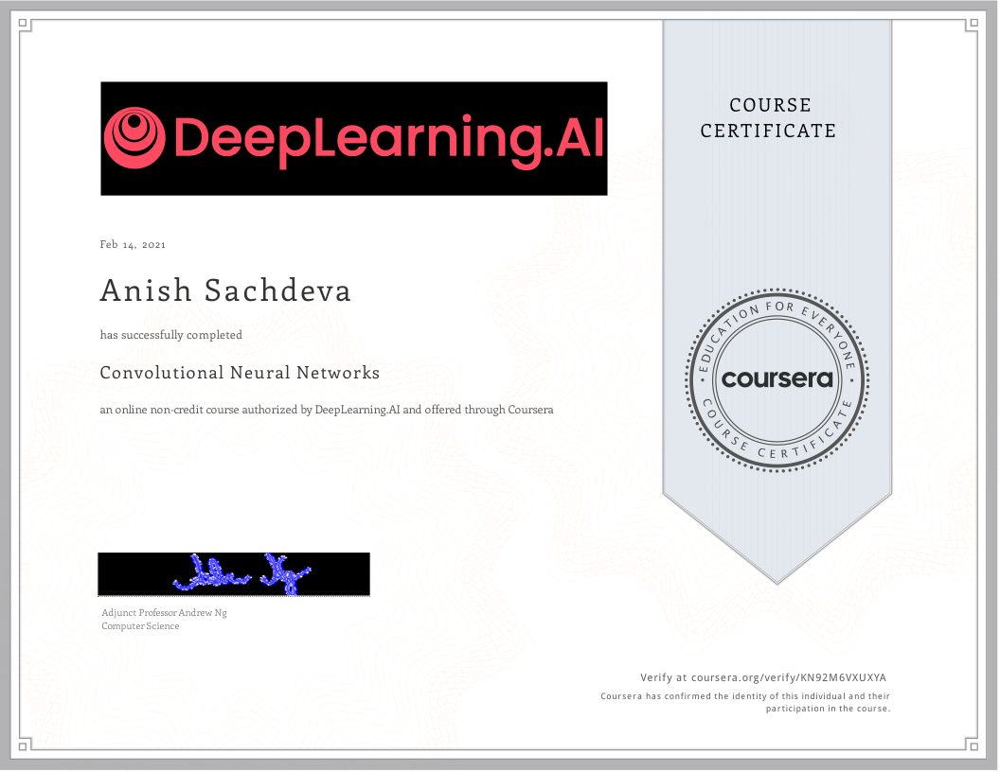

# Convolutional Neural Networks @Coursera

__Course by deeplearning.ai__

This is part of the 5 course specialization on 
[Deep Learning](https://github.com/anishLearnsToCode/deep-learning-ai) 
on Coursera. This is the fourth course.

## 📖 Overview
- [Week 1](#week-1)
- [Week 2](#week-2)
- [Week 3](#week-3)
- [Week 4](#week-4)
- [Certificate](#-certificate)

## Week 1
- [__Quiz__ - The Basics of ConvNets](week_1/quiz-the-basics-of-convnets/quiz-basic-of-convnets.md)
- [__Programming Assignment__ - Convolutional Model: Step by Step](week_1/cnn-models-step-by-step/Convolution_model_Step_by_Step_v2a.ipynb)
- [__Programming Assignment__ - Convolutional Model: Application](week_1/cnn-models-step-by-step/Convolution_model_Application_v1a.ipynb)

## Week 2
- [__Quiz__ - Deep Convolutional Models](week_2/deep-cnn-quiz/deep-cnn-quiz.md)
- [__Keras Tutorial (Ungraded)__](week_2/keras-tutorial/Keras_Tutorial_v2a.ipynb)
- [__Programming Assignment__ - Residual Networks](week_2/resnets/Residual_Networks_v2a.ipynb)

## Week 3
- [__Quiz__ - Detection Algorithms](week_3/quiz-detection-algorithms/quiz-detection-algo.md)
- [__Programming Assignment__ - Car Detection with YOLO](week_3/car-detection-autonomous-driving/Autonomous_driving_application_Car_detection_v3a.ipynb)

## Week 4
- [__Quiz__ - Special Applications: Face Recognition & Neural Style Transfer](week_4/quiz-special-applications-face-recog-neural-style-transfer/quiz.md)
- [__Programming Assignment__ - Art Generation With Neural Style Transfer](week_4/neural-style-transfer/Art_Generation_with_Neural_Style_Transfer_v3a.ipynb)
- [__Programming Assignment__ - Face Recognition](week_4/face-recognition/Face_Recognition_v3a.ipynb)

## 🎓 [Certificate](https://coursera.org/verify/KN92M6VXUXYA)

